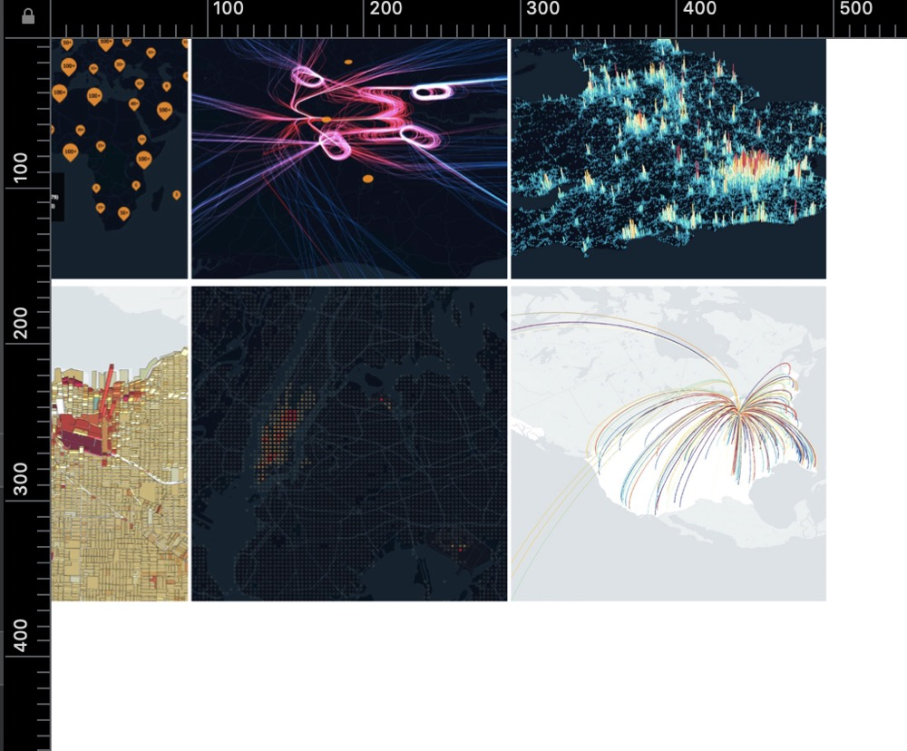

# [Week 1] 23 March 2020

## Basic Things You Need Know About Visualisation by D3.js

1. Coordinate System
   
   SVG elements aren't governed by a CSS box model like HTML elements are. You can view it as the absolute positioning in CSS. The origin point is on the top left. Any transformations and manipulating should based on the coordinate system.

   [0.5]

2. Basic Shapes in SVG
   
   * __```<rect>```__
  
    ```html
    <svg width="50" height="50">
        <rect x="0" y="0" width="50" height="50" fill="green" />
    </svg>
    ```

   * __```<circle>```__
  
    ```html
    <svg width="50" height="50">
        <circle cx="25" cy="25" r="25" fill="purple" />
    </svg>
    ```

   * __```<ellipse>```__
  
    ```html
    <svg width="50" height="50">
        <ellipse cx="25" cy="25" rx="15" ry="10" fill="red" />
    </svg>
    ```

   * __```<line>```__
  
    ```html
    <svg width="50" height="50">
        <line x1="5" y1="5" x2="40" y2="40" stroke="gray" stroke-width="5"  />
    </svg>
    ```

   * __```<polyline>```__
  
    ```html
    <svg width="50" height="50">
        <polyline fill="none" stroke="blue" stroke-width="2"
            points="05,30
                    15,30
                    15,20
                    25,20
                    25,10
                    35,10" />
    </svg>
    ```

   * __```<polygon>```__
  
    ```html
    <svg width="50" height="50">
          <polygon fill="yellow" stroke="blue" stroke-width="2"
            points="05,30
                    15,10
                    25,30" />
    </svg>
    ```

3. Basic Attributes in SVG

   * __```fill='#fff'```__
  
   * __```stroke='#f00'```__
  
   * __```stroke-width="5"```__

4. Basic step for Create a visualisation

   ```javascript
   // Data
   const data = {
        x: 0.5,
        y: 0.2,
        z: 0.8,
        a: 0.75
    }
    // Html element container
    const el = document.getElementById("container");
    // Layout configuration: margin
    const margin = {
        right: 20,
        left: 20,
        top: 20,
        bottom: 20
    }
    // Layout configuration: width and height
    let width = 200;
    let height = 200;
 
    // Svg container
    const svgContainer = d3.select(el).append("svg")
                .attr("width", width + margin.left + margin.right)
                .attr("height", height + margin.top + margin.bottom)
                .append("g")
                .attr("transalte", `translate(${margin.top}, ${margin.left})`);

    // To be continued

    // Define Scale

    // Define Axis

    // Create multiple DOM elements with Joins: enter/update/exit
   ```